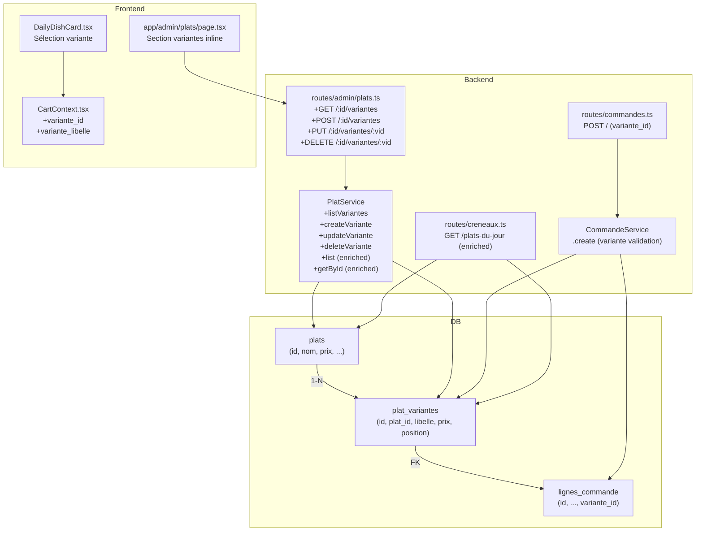

# Design Document — Plat Variantes

## Overview

La fonctionnalité **Plat Variantes** étend le modèle de données existant pour permettre à chaque plat de posséder une ou plusieurs variantes de prix nommées (ex. : "Standard", "Standard + 2 saucisses", "Star + aileron + 2 saucisses"). Elle est rétrocompatible : le champ `prix` de la table `plats` est maintenu en synchronisation avec le prix de la variante en position 1. Lorsqu'un plat n'a qu'une seule variante, le comportement actuel (ajout direct au panier sans sélection) est conservé.

### Objectifs clés

- Modèle de données : table `plat_variantes` liée à `plats` (1-N).
- Migration rétrocompatible : création automatique d'une variante "Standard" pour chaque plat existant.
- API admin CRUD complète sur les variantes.
- Enrichissement des endpoints existants (`GET /admin/plats`, `GET /plats-du-jour`).
- Validation des commandes : `variante_id` obligatoire si le plat a plusieurs variantes.
- UI admin : gestion inline des variantes par carte plat.
- UI employé : sélection de variante sur `DailyDishCard` avant ajout au panier.

---

## Architecture



### Flux principal — sélection de variante par un employé

```
Employé → GET /creneaux/plats-du-jour
         ← [{ id, nom, prix, variantes: [{id, libelle, prix}] }]

Employé sélectionne une variante dans DailyDishCard
→ CartContext.addItem({ variante_id, variante_libelle, prix })

Employé soumet le panier → POST /commandes
  body: { lignes: [{ type:'plat', plat_id, variante_id, quantite }] }
         ← commande créée avec prix_unitaire = variante.prix
```

---

## Components and Interfaces

### 1. Migration SQL — `013_create_plat_variantes.sql`

Crée la table `plat_variantes`, migre les prix existants, ajoute `variante_id` sur `lignes_commande`.

### 2. `PlatService` (backend)

Nouvelles méthodes :

```typescript
// Lister les variantes d'un plat, triées par position
listVariantes(platId: string): Promise<PlatVariante[]>

// Créer une variante
createVariante(platId: string, data: { libelle: string; prix: number }): Promise<PlatVariante>

// Mettre à jour une variante (+ sync plats.prix si position = 1)
updateVariante(platId: string, varianteId: string, data: Partial<{ libelle: string; prix: number }>): Promise<PlatVariante>

// Supprimer une variante (interdit si dernière)
deleteVariante(platId: string, varianteId: string): Promise<void>
```

Méthodes modifiées :

```typescript
// list() → inclut variantes[] via requête séparée (2 requêtes SQL max)
list(): Promise<PlatWithVariantes[]>

// getById() → inclut variantes[]
getById(id: string): Promise<PlatWithVariantes>

// create() → crée automatiquement une variante "Standard" après insertion
create(data: CreatePlatInput): Promise<PlatWithVariantes>
```

Interface `PlatVariante` :

```typescript
interface PlatVariante {
  id: string;
  plat_id: string;
  libelle: string;
  prix: number;
  position: number;
  created_at: string;
}

interface PlatWithVariantes extends Record<string, unknown> {
  variantes: PlatVariante[];
}
```

### 3. `routes/admin/plats.ts`

Schémas de validation Zod ajoutés :

```typescript
const VarianteSchema = z.object({
  libelle: z.string().min(1).max(255),
  prix: z.coerce.number().positive(),
});
```

Nouvelles routes (toutes sous `authenticate + requireAdmin`) :

| Méthode | Chemin | Handler |
|---------|--------|---------|
| GET | `/:id/variantes` | `PlatService.listVariantes` |
| POST | `/:id/variantes` | `PlatService.createVariante` → 201 |
| PUT | `/:id/variantes/:varianteId` | `PlatService.updateVariante` |
| DELETE | `/:id/variantes/:varianteId` | `PlatService.deleteVariante` |

### 4. `routes/commandes.ts` — schéma étendu

```typescript
const LigneCommandeSchema = z.object({
  type: z.enum(['plat', 'menu']),
  plat_id: z.string().uuid().optional(),
  variante_id: z.string().uuid().optional(),   // nouveau
  menu_complet_id: z.string().uuid().optional(),
  quantite: z.number().int().positive(),
  selections_options: z.array(SelectionOptionSchema).optional().default([]),
  jetable: z.boolean().optional().default(false),
});
```

### 5. `CommandeService.create` — logique variante

Pour chaque ligne de type `plat` :

1. Charger les variantes du plat (`SELECT ... FROM plat_variantes WHERE plat_id = $1`).
2. Si `variante_id` fourni → vérifier l'appartenance au plat → utiliser `variante.prix` comme `prix_unitaire`.
3. Si `variante_id` absent et plat mono-variante → auto-sélection de l'unique variante.
4. Si `variante_id` absent et plat multi-variantes → `AppError('VARIANTE_REQUIRED', ..., 422)`.
5. Insérer `variante_id` dans `lignes_commande`.

`getById` enrichi pour retourner `variante_id`, `variante_libelle`, `prix_unitaire` sur chaque ligne plat.

### 6. `routes/creneaux.ts` — enrichissement `GET /plats-du-jour`

La requête est étendue pour charger les variantes dans une seconde requête :

```typescript
// Après avoir chargé les plats du jour:
const platIds = rows.map(r => r.id);
const { rows: variantes } = await pool.query(
  `SELECT id, plat_id, libelle, prix, position
   FROM plat_variantes
   WHERE plat_id = ANY($1)
   ORDER BY plat_id, position`,
  [platIds]
);
// Grouper et attacher variantes[] à chaque plat
// Conserver plat.prix pour rétrocompatibilité (plat mono-variante)
```

### 7. `CartContext.tsx` — extension de `CartItem`

```typescript
export interface CartItem {
  key: string;
  type: 'plat' | 'menu';
  id: string;
  nom: string;
  prix: number;
  image_url?: string;
  quantite: number;
  selections_options?: SelectionOption[];
  jetable?: boolean;
  variante_id?: string;       // nouveau
  variante_libelle?: string;  // nouveau
}
```

La `key` pour un plat avec variante devient : `` `${plat.id}_${variante_id}_${jetable ? 'jetable' : 'normal'}` ``

### 8. `DailyDishCard.tsx` — sélection de variante

Interface étendue :

```typescript
interface Variante {
  id: string;
  libelle: string;
  prix: number;
}

interface Plat {
  id: string;
  nom: string;
  description?: string;
  prix: number;
  image_url?: string;
  avec_jetable?: boolean;
  variantes?: Variante[];  // nouveau
}
```

Logique :

- `variantes.length > 1` → afficher N boutons de sélection formatés `{prix} FCFA — {libellé}`, bouton "+ Ajouter" désactivé jusqu'à sélection.
- `variantes.length <= 1` → comportement actuel conservé (utiliser `plat.prix`, `variante_id` de l'unique variante si disponible).
- État local `selectedVariante: Variante | null`.
- À l'ajout : `CartItem` inclut `variante_id`, `variante_libelle`, `prix` de la variante sélectionnée.

### 9. `app/admin/plats/page.tsx` — section variantes inline

Par carte plat :
- Afficher la liste des variantes (libellé + prix + bouton Supprimer).
- Bouton "Ajouter une variante" → formulaire inline (libellé, prix, Valider/Annuler).
- Modification inline : champs éditables directement dans la liste, confirmation par "Enregistrer".
- Suppression gardée : si 1 seule variante, bouton Supprimer désactivé + tooltip explicatif (pas d'appel DELETE).
- Gestion des erreurs API : affichage d'un message d'erreur lisible.

---

## Data Models

### Table `plat_variantes`

```sql
CREATE TABLE IF NOT EXISTS plat_variantes (
  id         UUID PRIMARY KEY DEFAULT gen_random_uuid(),
  plat_id    UUID NOT NULL REFERENCES plats(id) ON DELETE CASCADE,
  libelle    TEXT NOT NULL,
  prix       NUMERIC(10, 2) NOT NULL CHECK (prix > 0),
  position   SMALLINT NOT NULL DEFAULT 1,
  created_at TIMESTAMPTZ DEFAULT NOW(),
  UNIQUE (plat_id, position)
);

CREATE INDEX IF NOT EXISTS idx_plat_variantes_plat_id ON plat_variantes(plat_id);
```

### Modification `lignes_commande`

```sql
ALTER TABLE lignes_commande
  ADD COLUMN IF NOT EXISTS variante_id UUID REFERENCES plat_variantes(id);
```

### Migration des données existantes

```sql
-- Pour chaque plat existant, insérer une variante "Standard"
INSERT INTO plat_variantes (plat_id, libelle, prix, position)
SELECT id, 'Standard', prix, 1
FROM plats
ON CONFLICT (plat_id, position) DO NOTHING;
```

### Synchronisation `plats.prix`

Lors de toute mise à jour d'une variante à `position = 1`, le service exécute :

```sql
UPDATE plats SET prix = $1, updated_at = NOW() WHERE id = $2;
```

---

## Correctness Properties

*A property is a characteristic or behavior that should hold true across all valid executions of a system — essentially, a formal statement about what the system should do. Properties serve as the bridge between human-readable specifications and machine-verifiable correctness guarantees.*

**Réflexion sur la redondance :**
- 1.4 et 1.5 sont distincts (création automatique vs synchronisation `plats.prix`) → conservés séparément.
- 2.1 (dernière variante rejetée) et 10.1 (invariant ≥ 1) se recoupent → fusionnés en Property 2.
- 6.2 (prix stocké) et 10.3 (prix commande = prix variante) sont identiques → fusionnés en Property 6.
- 3.3 (update round-trip) et 10.4 (séquence create/read/update/read) sont très proches → fusionnés en Property 7.
- 4.1 et 5.1 (variantes triées) sont le même invariant sur deux endpoints différents → conservés séparément.
- 8.4 (CartItem contient variante) et 8.5 (bouton désactivé si non sélectionné) sont distincts → conservés.

### Property 1: Migration — variante par défaut créée pour chaque plat

*Pour tout* ensemble de plats pré-existants en base, après exécution de la migration `013`, chaque plat doit posséder exactement une variante dont le `libelle = 'Standard'`, la `position = 1`, et le `prix` est égal au champ `prix` du plat correspondant dans la table `plats`.

**Validates: Requirements 1.4, 1.5**

### Property 2: Invariant de cardinalité — un plat a toujours au moins une variante

*Pour tout* plat, après toute séquence valide d'opérations de création, modification et suppression de variantes, le nombre de variantes associées à ce plat est toujours supérieur ou égal à 1. Toute tentative de suppression de la dernière variante retourne HTTP 409 avec le code `LAST_VARIANTE_ERROR`, et le nombre de variantes reste à 1.

**Validates: Requirements 2.1, 2.3, 10.1**

### Property 3: Création automatique de variante Standard à la création d'un plat

*Pour tout* plat créé via `POST /admin/plats` avec un `prix` positif quelconque et sans variante explicite, la liste des variantes de ce plat doit contenir exactement une entrée avec `libelle = 'Standard'` et `prix` égal à la valeur fournie lors de la création.

**Validates: Requirements 2.2**

### Property 4: Listing des variantes trié par position croissante

*Pour tout* plat possédant N variantes (N ≥ 1) avec des positions quelconques, la réponse de `GET /admin/plats/:id/variantes` doit retourner une liste triée par `position` croissante, et pour tout indice i < j, `variantes[i].position < variantes[j].position`.

**Validates: Requirements 3.1**

### Property 5: Validation des entrées — rejet de prix invalide ou libellé vide

*Pour tout* corps de requête `POST` ou `PUT` sur les variantes contenant un `prix` inférieur ou égal à 0 ou un `libellé` composé uniquement de caractères blancs (ou vide), l'API doit retourner HTTP 422 avec le code `VALIDATION_ERROR`, et aucune variante ne doit être créée ni modifiée.

**Validates: Requirements 3.6**

### Property 6: Prix de la variante enregistré fidèlement dans la commande

*Pour tout* plat avec une variante dont le prix est `P`, lorsqu'une commande est créée avec `variante_id` référençant cette variante, le champ `prix_unitaire` de la ligne de commande correspondante dans la table `lignes_commande` doit être égal à `P`. La réponse de `GET /commandes/:id` doit retourner `variante_id`, `variante_libelle` et `prix_unitaire = P` pour cette ligne.

**Validates: Requirements 6.2, 6.5, 6.6, 10.3**

### Property 7: Round-trip fidélité des données de variante

*Pour tout* couple `(libellé non vide, prix positif)` quelconque, la séquence create → read → update → read doit préserver les valeurs écrites à chaque étape : la première lecture retourne les valeurs de création, la seconde lecture retourne les valeurs de mise à jour.

**Validates: Requirements 3.2, 3.3, 10.4**

### Property 8: Synchronisation plats.prix avec la variante position 1

*Pour tout* nouveau prix positif `P'` appliqué via `PUT /admin/plats/:id/variantes/:varianteId` à la variante dont la `position = 1`, le champ `prix` dans la table `plats` pour ce plat doit être égal à `P'` après la mise à jour.

**Validates: Requirements 3.7**

### Property 9: Listing admin enrichi — variantes présentes et triées pour chaque plat

*Pour tout* ensemble de plats avec des variantes en positions quelconques, la réponse de `GET /admin/plats` doit inclure pour chaque plat une propriété `variantes` non nulle, contenant les variantes triées par position croissante, avec les champs `id`, `libelle`, `prix` et `position` présents pour chacune.

**Validates: Requirements 4.1, 4.2**

### Property 10: API employé — variantes présentes et triées dans plats du jour

*Pour tout* ensemble de plats du jour avec des variantes, la réponse de `GET /creneaux/plats-du-jour` doit inclure pour chaque plat une propriété `variantes` triée par position croissante avec les champs `id`, `libelle`, `prix`. Pour tout plat avec exactement une variante, le champ `plat.prix` doit rester présent et égal au prix de cette variante.

**Validates: Requirements 5.1, 5.2**

### Property 11: Variante obligatoire pour plat multi-variantes dans une commande

*Pour tout* plat possédant plus d'une variante, une requête `POST /commandes` soumise sans `variante_id` dans la ligne correspondante doit retourner HTTP 422 avec le code `VARIANTE_REQUIRED`, et aucune commande ne doit être créée.

**Validates: Requirements 6.3**

### Property 12: Auto-sélection de variante pour plat mono-variante dans une commande

*Pour tout* plat possédant exactement une variante de prix `P`, une requête `POST /commandes` soumise sans `variante_id` doit enregistrer `prix_unitaire = P` dans la ligne de commande, comme si la variante avait été explicitement sélectionnée.

**Validates: Requirements 6.4**

### Property 13: CartItem contient variante_id, variante_libelle et prix corrects

*Pour toute* variante sélectionnée parmi les variantes d'un plat, lorsque l'employé clique sur "+ Ajouter", le `CartItem` ajouté au panier doit contenir `variante_id` correspondant à la variante sélectionnée, `variante_libelle` égal au libellé de cette variante, et `prix` égal au prix de cette variante.

**Validates: Requirements 8.4, 9.1**

### Property 14: Bouton Ajouter désactivé jusqu'à sélection d'une variante

*Pour tout* plat possédant plus d'une variante, le bouton "+ Ajouter" du composant `DailyDishCard` doit être désactivé (`disabled = true`) tant qu'aucune variante n'est sélectionnée dans l'état local du composant.

**Validates: Requirements 8.5**

### Property 15: Calcul du total panier à partir des prix des variantes

*Pour tout* ensemble de `CartItem` avec des prix et quantités quelconques, le `total` calculé par `CartContext` doit être égal à la somme de `(item.prix × item.quantite)` pour tous les items du panier.

**Validates: Requirements 9.3**

## Error Handling

| Situation | Code d'erreur | HTTP |
|-----------|---------------|------|
| Suppression de la dernière variante d'un plat | `LAST_VARIANTE_ERROR` | 409 |
| Variante inexistante ou mauvais plat_id | `RESOURCE_NOT_FOUND` | 404 |
| Prix ≤ 0 ou libellé vide/blank | `VALIDATION_ERROR` | 422 |
| Commande soumise sans variante_id (plat multi-variantes) | `VARIANTE_REQUIRED` | 422 |
| variante_id n'appartient pas au plat_id | `VALIDATION_ERROR` | 422 |

Toutes les erreurs suivent le format existant de `AppError` :

```typescript
throw new AppError('CODE', 'Message lisible', httpStatus);
```

Le frontend admin doit capturer les codes `LAST_VARIANTE_ERROR` et `VALIDATION_ERROR` pour afficher un message inline plutôt qu'un toast générique.

---

## Testing Strategy

### Approche duale

La fonctionnalité dispose d'une logique métier suffisamment riche (règles de prix, cardinalité, synchronisation) pour justifier des tests property-based en complément des tests d'exemple.

**Bibliothèque PBT choisie : [fast-check](https://github.com/dubzzz/fast-check)** (TypeScript natif, compatible Jest/Vitest, déjà courant dans les projets Node.js).

### Tests property-based (backend)

Chaque propriété correspond à un test `fc.assert(fc.property(...))` avec minimum **100 itérations**.

| Property | Fichier | Itérations min |
|----------|---------|----------------|
| P1 — Migration variante par défaut | `platService.property.test.ts` | 100 |
| P2 — Cardinalité ≥ 1 | `platService.property.test.ts` | 100 |
| P3 — Création auto variante Standard | `platService.property.test.ts` | 100 |
| P4 — Tri par position | `platService.property.test.ts` | 100 |
| P5 — Rejet inputs invalides | `platService.property.test.ts` | 100 |
| P6 — Prix variante dans commande | `commandeService.property.test.ts` | 100 |
| P7 — Round-trip create/read/update/read | `platService.property.test.ts` | 100 |
| P8 — Sync plats.prix avec variante pos 1 | `platService.property.test.ts` | 100 |
| P11 — VARIANTE_REQUIRED multi-variantes | `commandeService.property.test.ts` | 100 |
| P12 — Auto-sélection mono-variante | `commandeService.property.test.ts` | 100 |

Tag de chaque test : `// Feature: plat-variantes, Property N: <texte>`

### Tests property-based (frontend)

| Property | Fichier | Itérations min |
|----------|---------|----------------|
| P13 — CartItem contient variante_id/libelle/prix | `CartContext.property.test.ts` | 100 |
| P14 — Bouton désactivé sans sélection | `DailyDishCard.property.test.tsx` | 100 |
| P15 — Total panier = Σ(prix × quantite) | `CartContext.property.test.ts` | 100 |

### Tests d'exemple et d'intégration

- `GET /admin/plats` retourne variantes[] — test d'intégration API.
- `GET /creneaux/plats-du-jour` retourne variantes[] — test d'intégration API.
- Contrainte UNIQUE (plat_id, position) — test d'exemple DB.
- Suppression variante non-dernière → 200 — test d'exemple.
- PUT/DELETE variante inexistante → 404 — test de cas limite.
- DailyDishCard mono-variante — test de snapshot React.
- DailyDishCard multi-variantes → sélection + activation bouton — test d'exemple React.
- Page admin plats — vérification affichage section variantes — test de snapshot.

### Tests UI (smoke / visuel)

- Affichage de la section variantes dans la page admin : test de rendu manuel.
- Message d'erreur lors d'une tentative de suppression de la dernière variante côté UI : test d'exemple React.
