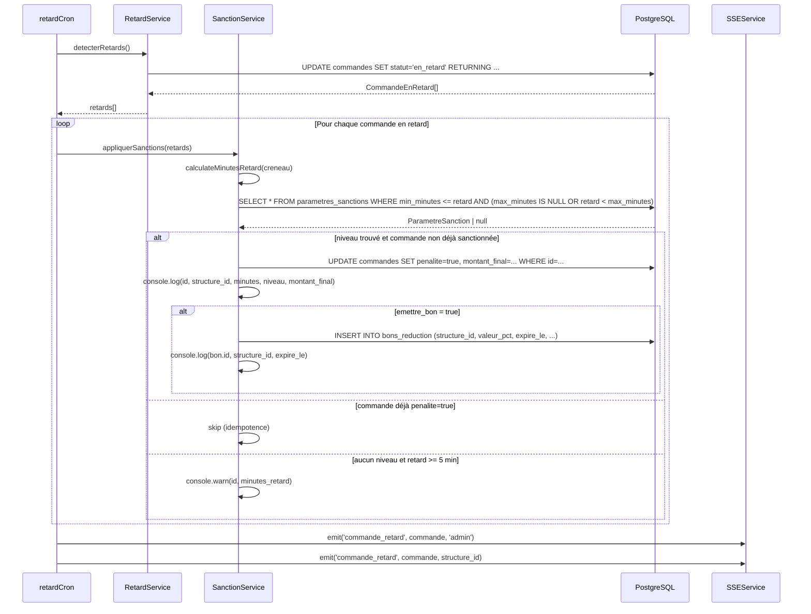

# Design Document — Sanctions System

## Overview

Le système de sanctions remplace la pénalité fixe à 50 % (`penaliteService.ts`) par une logique configurable à plusieurs niveaux. Chaque commande marquée `en_retard` par le cron existant reçoit une sanction dont le taux et les effets (émission d'un bon de réduction) dépendent de la durée du retard, définie dans la table `parametres_sanctions`.

L'objectif central est la **séparation des responsabilités** :

- `retardService.ts` détecte et marque les retards — inchangé.
- `sanctionService.ts` (nouveau) calcule et applique les sanctions — lit les paramètres en base.
- `retardCron.ts` orchestre : détection → application des sanctions → SSE.
- L'interface admin Next.js permet de modifier les paramètres sans toucher au code.

### Contraintes d'intégration clés

| Contrainte | Décision |
|---|---|
| `penaliteService.ts` applique 50 % en dur | Remplacé par `sanctionService.ts` ; `penaliteService` gardé pour compatibilité route manuelle |
| `retardCron.ts` appelle déjà `detecterRetards()` | On ajoute un appel `SanctionService.appliquerSanctions(retards)` juste après |
| `commandes.penalite = true` déjà persisté | Le service doit respecter l'idempotence et ignorer les commandes déjà sanctionnées |
| Migrations séquencées (001–008 existantes) | Nouvelles migrations : 009 et 010 |

---

## Architecture

```
┌────────────────────────────────────────────────────────────────┐
│                        retardCron.ts                           │
│  schedule: * * * * *                                           │
│                                                                │
│  1. RetardService.detecterRetards()  ──► [CommandeEnRetard[]]  │
│  2. SanctionService.appliquerSanctions(retards)                │
│  3. SSEService.emit('commande_retard', ...)                    │
└─────────────────────────────────┬──────────────────────────────┘
                                  │
                    ┌─────────────▼─────────────┐
                    │     sanctionService.ts     │
                    │                            │
                    │  calculateMinutesRetard()  │
                    │  findNiveau()              │◄── parametres_sanctions
                    │  calculerMontantFinal()    │
                    │  appliquerSanction()       │──► commandes (UPDATE)
                    │  emettresBon()             │──► bons_reduction (INSERT)
                    └────────────────────────────┘

┌─────────────────────────────────────────────────────────────────┐
│                   Admin HTTP Layer                               │
│                                                                  │
│  GET  /api/v1/admin/sanctions/parametres                         │
│  PATCH /api/v1/admin/sanctions/parametres/:niveau                │
│  GET  /api/v1/admin/sanctions/bons                               │
│  GET  /api/v1/admin/sanctions/historique                         │
│         │                                                        │
│  routes/admin/sanctions.ts ──► sanctionService.ts               │
└─────────────────────────────────────────────────────────────────┘

┌──────────────────────────────────────┐
│  Frontend Next.js App Router         │
│  app/admin/sanctions/page.tsx        │
│   • Tableau éditable niveaux 1–4     │
│   • Liste bons (lecture seule)       │
└──────────────────────────────────────┘
```

### Diagramme de séquence — Application d'une sanction



---

## Components and Interfaces

### `sanctionService.ts` (nouveau)

```typescript
interface ParametreSanction {
  niveau: number;           // 1–4
  min_minutes: number;
  max_minutes: number | null;
  reduction_pct: number;    // 0–100
  emettre_bon: boolean;
}

interface ResultatSanction {
  commande_id: string;
  niveau: number | null;
  montant_final: number;
  bon_emis: boolean;
  bon_id?: string;
}

const SanctionService = {
  // Calcule les minutes de retard depuis l'heure courante
  calculateMinutesRetard(creneau: string): number,

  // Retourne le niveau de sanction applicable ou null
  findNiveau(minutesRetard: number): Promise<ParametreSanction | null>,

  // Calcule le montant final selon reduction_pct
  calculerMontantFinal(montantTotal: number, reductionPct: number): number,

  // Applique la sanction sur une commande individuelle (idempotent)
  appliquerSanction(commande: CommandeEnRetard): Promise<ResultatSanction | null>,

  // Traite un lot de commandes en retard (appelé par le cron)
  appliquerSanctions(commandes: CommandeEnRetard[]): Promise<void>,

  // CRUD paramètres pour les routes admin
  getParametres(): Promise<ParametreSanction[]>,
  updateParametre(niveau: number, patch: Partial<ParametreSanction>): Promise<ParametreSanction>,

  // Historique
  getHistorique(filters: { date?: string; structure_id?: string }): Promise<HistoriqueSanction[]>,
  getBons(filters: { structure_id?: string; date?: string }): Promise<BonReduction[]>,
};
```

### `routes/admin/sanctions.ts` (nouveau)

| Méthode | Chemin | Description |
|---|---|---|
| `GET` | `/api/v1/admin/sanctions/parametres` | Liste des 4 niveaux |
| `PATCH` | `/api/v1/admin/sanctions/parametres/:niveau` | Modifier un niveau (validation Zod) |
| `GET` | `/api/v1/admin/sanctions/bons` | Bons émis (filtres: `structure_id`, `date`) |
| `GET` | `/api/v1/admin/sanctions/historique` | Historique sanctions (filtres: `date`, `structure_id`) |

Toutes les routes utilisent `authenticate + requireAdmin` comme les autres routes admin du projet.

### `app/admin/sanctions/page.tsx` (nouveau)

Page `'use client'` avec deux sections :

1. **Tableau éditable** — 4 lignes pour les niveaux de sanction. Chaque cellule `min_minutes`, `max_minutes`, `reduction_pct`, `emettre_bon` est éditable inline. Bouton "Enregistrer" par ligne envoie un `PATCH`.
2. **Liste des bons** — tableau en lecture seule avec colonnes : structure, valeur, émis le, expire le, statut.

Utilise `apiFetch` (déjà en place), `useState`/`useEffect`, composants Tailwind existants.

### Fichiers modifiés

**`retardCron.ts`** — ajout après `detecterRetards()` :
```typescript
import SanctionService from '../services/sanctionService';
// ...
const retards = await RetardService.detecterRetards();
await SanctionService.appliquerSanctions(retards); // ← nouveau
```

**`index.ts`** — enregistrement nouvelle route :
```typescript
import sanctionsRouter from './routes/admin/sanctions';
// ...
app.use(`${API}/admin/sanctions`, sanctionsRouter);
```

**`retardService.ts`** — aucune modification requise. Le seuil de 10 min reste la détection du statut ; le calcul précis des minutes se fait dans `sanctionService.ts` à partir du `creneau` retourné.

---

## Data Models

### Table `parametres_sanctions` (migration 009)

```sql
CREATE TABLE parametres_sanctions (
  niveau        INT PRIMARY KEY CHECK (niveau BETWEEN 1 AND 4),
  min_minutes   INT NOT NULL CHECK (min_minutes >= 0),
  max_minutes   INT,  -- NULL = illimité
  reduction_pct INT NOT NULL CHECK (reduction_pct BETWEEN 0 AND 100),
  emettre_bon   BOOLEAN NOT NULL DEFAULT FALSE
);

INSERT INTO parametres_sanctions VALUES
  (1,  5,  9,  50,  false),
  (2, 10, 19, 100, false),
  (3, 20, NULL, 100, true);
```

**Invariants garantis par la DB** :
- `niveau` ∈ [1, 4]
- `reduction_pct` ∈ [0, 100]
- `min_minutes >= 0`
- L'absence de chevauchement entre niveaux est une contrainte applicative (pas DB) — vérifiée par les tests de propriété.

### Table `bons_reduction` (migration 010)

```sql
CREATE TABLE bons_reduction (
  id                  UUID PRIMARY KEY DEFAULT gen_random_uuid(),
  structure_id        UUID NOT NULL REFERENCES structures(id) ON DELETE CASCADE,
  valeur_pct          INT NOT NULL CHECK (valeur_pct BETWEEN 1 AND 100),
  emis_le             TIMESTAMPTZ DEFAULT NOW(),
  expire_le           TIMESTAMPTZ NOT NULL,
  utilise             BOOLEAN DEFAULT FALSE,
  commande_id_source  UUID REFERENCES commandes(id)
);

CREATE INDEX idx_bons_structure   ON bons_reduction(structure_id);
CREATE INDEX idx_bons_expire      ON bons_reduction(expire_le);
CREATE INDEX idx_bons_utilise     ON bons_reduction(utilise);
```

### Table `commandes` — colonnes existantes utilisées

| Colonne | Type | Rôle dans le système de sanctions |
|---|---|---|
| `id` | UUID | Clé primaire |
| `structure_id` | UUID | Destinataire potentiel du bon |
| `creneau` | TIME | Base du calcul des minutes de retard |
| `montant_total` | NUMERIC(10,2) | Base du calcul du montant final |
| `montant_final` | NUMERIC(10,2) | Mis à jour par `sanctionService` |
| `penalite` | BOOLEAN | Guard d'idempotence |
| `statut` | ENUM | Doit être `en_retard` avant sanction |

### Table `historique_sanctions` (optionnelle — recommandée)

Pour le requirement 6.3, plutôt que de faire une jointure complexe sur `commandes`, une table de log dédiée simplifie l'API historique :

```sql
CREATE TABLE historique_sanctions (
  id              UUID PRIMARY KEY DEFAULT gen_random_uuid(),
  commande_id     UUID NOT NULL REFERENCES commandes(id),
  structure_id    UUID NOT NULL,
  minutes_retard  INT NOT NULL,
  niveau          INT,
  montant_final   NUMERIC(10,2),
  applique_le     TIMESTAMPTZ DEFAULT NOW()
);
```

Cette table est alimentée par `sanctionService.ts` à chaque sanction appliquée.

---

## Correctness Properties

*Une propriété est une caractéristique ou un comportement qui doit rester vrai pour toutes les exécutions valides d'un système — essentiellement, un énoncé formel de ce que le système doit faire. Les propriétés servent de pont entre les spécifications lisibles par l'humain et les garanties de correction vérifiables automatiquement.*

Le système de sanctions est un bon candidat pour les tests à base de propriétés car il contient de la logique pure (calcul de niveaux, calcul de montants) avec des espaces d'entrée larges et des invariants clairs à vérifier.

---

### Réflexion sur la redondance

Avant de lister les propriétés finales, examinons la redondance :

- Les critères 2.2 (minutes < 5 → null) et 2.4 (reduction_pct=100 → montant=0) sont des **cas limites** couverts par les générateurs des propriétés 2.1 et 2.3 respectivement — pas de propriété séparée nécessaire.
- Les critères 3.2 et 3.3 (application niveaux 1 et 2) sont couverts par **Property 4** (application conditionnée par `emettre_bon`) combinée avec les propriétés de calcul.
- Les critères 1.4 et 1.5 (validation PATCH) peuvent être **fusionnés** en une seule propriété de validation des paramètres.
- Les critères 6.1 et 6.2 (logs console) sont analogues — **fusionnés** en une propriété de journalisation.

---

### Property 1: Unicite du niveau de sanction

*Pour tout* entier `minutes_retard` compris entre 0 et 1000, la fonction `findNiveau(minutes_retard)` doit retourner au plus un niveau de sanction (absence de chevauchement entre les plages).

**Validates: Requirements 2.5**

---

### Property 2: Coherence du lookup de niveau

*Pour tout* entier `minutes_retard` ≥ 0, si `findNiveau` retourne un niveau `N` avec `min_minutes` et `max_minutes`, alors `min_minutes <= minutes_retard` et (`max_minutes IS NULL` ou `minutes_retard < max_minutes`). Si `minutes_retard < 5`, le résultat est `null`.

**Validates: Requirements 2.1, 2.2**

---

### Property 3: Calcul du montant final

*Pour tout* `montant_total` ≥ 0 et tout `reduction_pct` ∈ [0, 100], `calculerMontantFinal(montant_total, reduction_pct)` doit retourner `ROUND(montant_total * (1 - reduction_pct / 100), 2)` et le résultat ne doit jamais être négatif.

**Validates: Requirements 2.3, 2.4**

---

### Property 4: Emission conditionnelle de bon

*Pour tout* niveau de sanction avec `emettre_bon = true` et toute commande en retard éligible, l'appel à `appliquerSanction()` doit créer exactement un enregistrement dans `bons_reduction` pour la structure concernée. Si `emettre_bon = false`, aucun bon ne doit être créé.

**Validates: Requirements 3.4, 4.4**

---

### Property 5: Idempotence de l application des sanctions

*Pour toute* commande possédant déjà `penalite = true`, appeler `appliquerSanction()` une ou plusieurs fois supplémentaires ne doit pas modifier `montant_final` ni créer de nouveau bon. L'état de la commande après N applications (N ≥ 1) est identique à l'état après 1 application.

**Validates: Requirements 3.5**

---

### Property 6: Validation des parametres de sanction

*Pour tout* appel `PATCH /parametres/:niveau` avec `reduction_pct` ∉ [0, 100] ou `min_minutes` < 0, le service doit retourner HTTP 422. *Pour tout* appel avec des valeurs dans les plages valides, le service doit retourner HTTP 200 et persister les nouvelles valeurs.

**Validates: Requirements 1.4, 1.5**

---

### Property 7: Expiration des bons de reduction

*Pour tout* bon de réduction dont `expire_le < NOW()`, toute tentative d'utilisation doit être rejetée avec HTTP 422, quelle que soit la valeur des autres champs.

**Validates: Requirements 4.5**

---

### Property 8: Duree d expiration des bons emis

*Pour tout* bon émis par `emettresBon()`, la valeur de `expire_le` doit être exactement `emis_le + INTERVAL '30 days'` (à la seconde près, compte tenu des arrondis de timestamp).

**Validates: Requirements 4.2**

---

### Property 9: Completude des logs de sanction

*Pour toute* sanction appliquée avec succès, le log console doit contenir les cinq champs requis : `commande_id`, `structure_id`, `minutes_retard`, `niveau`, `montant_final`. *Pour tout* bon émis, le log doit contenir `bon_id`, `structure_id`, `expire_le`.

**Validates: Requirements 6.1, 6.2**

---

### Property 10: Filtrage de l historique

*Pour tout* appel `GET /historique` avec un filtre `date` ou `structure_id`, tous les enregistrements retournés doivent satisfaire le critère de filtre — aucun enregistrement hors-filtre ne doit apparaître dans les résultats.

**Validates: Requirements 6.3**

---

## Error Handling

### Stratégie générale

Le projet utilise `AppError` (dans `utils/errors.ts`) propagé via `next(err)` vers le middleware `errorHandler`. Les nouveaux composants respectent ce pattern.

### Cas d'erreur spécifiques

| Situation | Comportement |
|---|---|
| `PATCH /parametres/:niveau` avec valeurs invalides | Zod parse → `AppError('VALIDATION_ERROR', ..., 422)` |
| Niveau de sanction inexistant pour retard ≥ 5 min | Log `console.warn` + aucune modification DB |
| Erreur DB sur une commande dans un batch | Log `console.error` avec `commande_id` + continue le batch |
| Bon expiré utilisé | `AppError('BON_EXPIRE', ..., 422)` |
| Route sans auth | Middleware `authenticate` → 401 (déjà en place) |
| `niveau` inexistant dans PATCH | Query retourne 0 lignes → `AppError('RESOURCE_NOT_FOUND', ..., 404)` |

### Isolation des erreurs dans le batch

`appliquerSanctions()` enveloppe chaque commande dans un `try/catch` individuel pour éviter qu'une erreur sur une commande bloque les suivantes (requirement 3.6) :

```typescript
for (const commande of commandes) {
  try {
    await appliquerSanction(commande);
  } catch (err) {
    console.error(`[SanctionService] Erreur commande ${commande.id}:`, err);
  }
}
```

---

## Testing Strategy

### Approche duale

Les tests combinent des **tests unitaires/d'exemples** pour les comportements spécifiques et des **tests à base de propriétés** pour les invariants universels.

**Bibliothèque PBT choisie** : [fast-check](https://fast-check.dev/) — compatible TypeScript, maintenu activement, intégration native avec Vitest/Jest.

**Configuration** : minimum 100 itérations par test de propriété (`numRuns: 100`).

**Format de tag** :
```
// Feature: sanctions-system, Property N: <texte>
```

### Tests de propriétés (fast-check)

| Propriété | Arb. d'entrée | Assertion |
|---|---|---|
| P1 — Unicité niveau | `fc.integer({ min: 0, max: 1000 })` | `matchingNiveaux.length <= 1` |
| P2 — Cohérence lookup | `fc.integer({ min: 0, max: 1000 })` | Plage du niveau retourné contient l'entrée |
| P3 — Calcul montant | `fc.tuple(fc.float({ min: 0 }), fc.integer({ min: 0, max: 100 }))` | `result == ROUND(total * (1 - pct/100), 2)` et `result >= 0` |
| P4 — Émission bon | `fc.boolean()` pour `emettre_bon` + commande générée | Présence/absence bon dans bons_reduction |
| P5 — Idempotence | Commande avec `penalite=true` | `montant_final` inchangé après 2e appel |
| P6 — Validation PATCH | `fc.integer().filter(n => n < 0 || n > 100)` pour `reduction_pct` | HTTP 422 |
| P7 — Expiration bon | Bon avec `expire_le` dans le passé | HTTP 422 à l'utilisation |
| P8 — Durée 30 jours | Timestamp d'émission aléatoire | `expire_le - emis_le == 30 days` |
| P9 — Logs complets | Commande aléatoire valide | Log spy contient les 5 champs requis |
| P10 — Filtrage historique | Lots de sanctions avec dates/structures variées | Tous les résultats satisfont le filtre |

### Tests unitaires d'exemples

- Seed des valeurs par défaut : vérifier que les 3 niveaux (1, 2, 3) sont présents après migration 009.
- Commande sans niveau correspondant (retard ≥ 5 min, aucun niveau configuré) : vérifier log warn + commande inchangée.
- Erreur isolée dans un batch de 3 commandes : vérifier que les 2 autres sont traitées.
- Interface admin : rendu composant avec niveaux mockés (React Testing Library).
- État loading/error/success sur le formulaire d'édition.

### Tests d'intégration

- `PATCH /parametres/:niveau` avec token admin valide → 200 + valeur persistée.
- `PATCH /parametres/:niveau` sans token → 401.
- Flux complet cron : commandes en retard → sanctions appliquées → bons créés (DB de test).

### Structure des fichiers de test

```
apps/backend/src/services/__tests__/
  sanctionService.property.test.ts   # tests PBT fast-check
  sanctionService.unit.test.ts       # exemples et edge cases

apps/backend/src/routes/admin/__tests__/
  sanctions.integration.test.ts      # tests routes HTTP

apps/frontend/app/admin/sanctions/__tests__/
  page.test.tsx                      # tests React Testing Library
```
