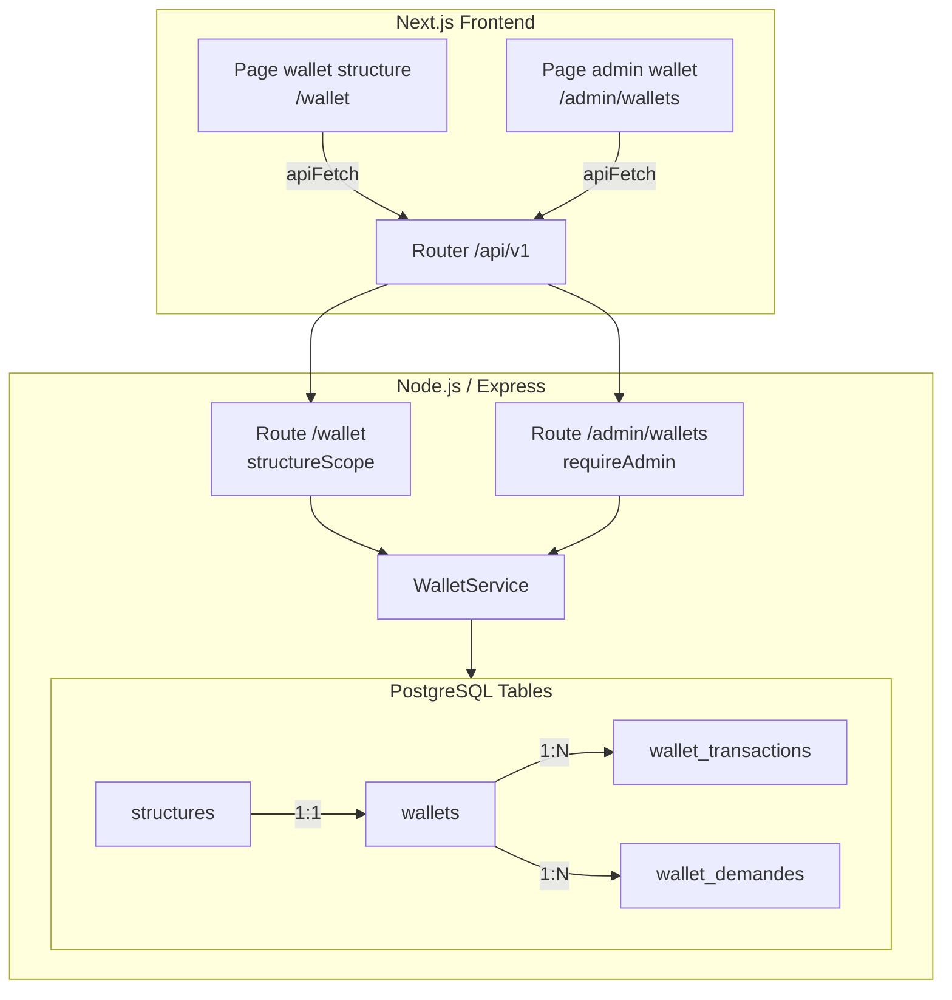

# Document de Design — Wallet RestoMoney

## Overview

Le Wallet RestoMoney introduit un système de portefeuille électronique (en FCFA) associé à chaque structure cliente. Il s'intègre au backend Node.js/Express/PostgreSQL existant en ajoutant deux nouvelles tables (`wallets`, `wallet_transactions`, `wallet_demandes`), un service `WalletService`, et des routes dédiées côté admin et structure. Le frontend Next.js expose une page de gestion du wallet pour la structure et une interface d'administration pour les recharges et les demandes de fonds.

---

## Architecture



---

## Components and Interfaces

### Backend

#### Routes

| Route | Méthode | Rôle | Description |
|---|---|---|---|
| `/api/v1/admin/wallets` | GET | admin | Liste tous les wallets avec solde |
| `/api/v1/admin/wallets/:structureId` | GET | admin | Détail wallet d'une structure |
| `/api/v1/admin/wallets/:structureId/recharge` | POST | admin | Recharger le wallet d'une structure |
| `/api/v1/admin/wallets/transactions` | GET | admin | Historique global toutes transactions |
| `/api/v1/admin/wallets/demandes` | GET | admin | Liste toutes les demandes de fonds |
| `/api/v1/admin/wallets/demandes/:id/statut` | PATCH | admin | Changer statut d'une demande |
| `/api/v1/wallet` | GET | structure | Solde + historique de la structure |
| `/api/v1/wallet/payer` | POST | structure | Débiter le wallet pour une commande |
| `/api/v1/wallet/demandes` | GET | structure | Lister ses demandes de fonds |
| `/api/v1/wallet/demandes` | POST | structure | Soumettre une demande de fonds |

#### WalletService — Interface publique

```typescript
interface WalletService {
  // Lecture
  getWalletByStructure(structureId: string): Promise<Wallet>;
  getTransactions(structureId: string, page: number, limit: number): Promise<TransactionPage>;
  getAllTransactions(page: number, limit: number, structureId?: string): Promise<TransactionPage>;
  getDemandes(structureId: string): Promise<Demande[]>;
  getAllDemandes(): Promise<Demande[]>;

  // Opérations
  recharge(structureId: string, montant: number, adminId: string): Promise<Transaction>;
  debiter(structureId: string, montant: number, password: string): Promise<Transaction>;
  soumettreDemandeComplement(structureId: string, input: DemandeInput): Promise<Demande>;
  updateDemandeStatut(demandeId: string, statut: DemandeStatut, motif?: string, adminId?: string): Promise<Demande>;

  // Lifecycle
  createWalletForStructure(structureId: string, client: PoolClient): Promise<void>;
}
```

#### Types

```typescript
type DemandeStatut = 'en_attente' | 'acceptee' | 'collecte_en_cours' | 'completee' | 'refusee';
type TransactionType = 'recharge' | 'debit' | 'credit_demande';

interface Wallet {
  id: string;
  structure_id: string;
  solde: number; // en FCFA, entier ≥ 0
  updated_at: string;
}

interface Transaction {
  id: string;
  wallet_id: string;
  type: TransactionType;
  montant: number;
  solde_avant: number;
  solde_apres: number;
  admin_id?: string;
  reference?: string;
  created_at: string;
}

interface DemandeInput {
  montant_demande: number;
  adresse_collecte: string;
  contact: string;
  notes?: string;
}

interface Demande {
  id: string;
  structure_id: string;
  montant_demande: number;
  adresse_collecte: string;
  contact: string;
  notes?: string;
  statut: DemandeStatut;
  motif_refus?: string;
  created_at: string;
  updated_at: string;
}

interface TransactionPage {
  items: Transaction[];
  total: number;
  page: number;
  limit: number;
}
```

---

## Data Models

### Table `wallets`

```sql
CREATE TABLE wallets (
  id           UUID        PRIMARY KEY DEFAULT gen_random_uuid(),
  structure_id UUID        NOT NULL UNIQUE REFERENCES structures(id) ON DELETE CASCADE,
  solde        BIGINT      NOT NULL DEFAULT 0 CHECK (solde >= 0),
  created_at   TIMESTAMPTZ NOT NULL DEFAULT NOW(),
  updated_at   TIMESTAMPTZ NOT NULL DEFAULT NOW()
);

CREATE INDEX idx_wallets_structure ON wallets(structure_id);
```

> Le type `BIGINT` évite les débordements sur de gros montants FCFA. La contrainte `CHECK (solde >= 0)` est un filet de sécurité côté base de données en complément des vérifications applicatives.

### Table `wallet_transactions`

```sql
CREATE TABLE wallet_transactions (
  id          UUID          PRIMARY KEY DEFAULT gen_random_uuid(),
  wallet_id   UUID          NOT NULL REFERENCES wallets(id) ON DELETE CASCADE,
  type        TEXT          NOT NULL CHECK (type IN ('recharge', 'debit', 'credit_demande')),
  montant     BIGINT        NOT NULL CHECK (montant > 0),
  solde_avant BIGINT        NOT NULL,
  solde_apres BIGINT        NOT NULL,
  admin_id    UUID          REFERENCES admins(id),
  reference   TEXT,         -- ex: commande ID, demande ID
  created_at  TIMESTAMPTZ   NOT NULL DEFAULT NOW()
);

CREATE INDEX idx_wallet_tx_wallet ON wallet_transactions(wallet_id);
CREATE INDEX idx_wallet_tx_created ON wallet_transactions(created_at DESC);
```

### Table `wallet_demandes`

```sql
CREATE TABLE wallet_demandes (
  id               UUID        PRIMARY KEY DEFAULT gen_random_uuid(),
  structure_id     UUID        NOT NULL REFERENCES structures(id) ON DELETE CASCADE,
  montant_demande  BIGINT      NOT NULL CHECK (montant_demande > 0),
  adresse_collecte TEXT        NOT NULL,
  contact          TEXT        NOT NULL,
  notes            TEXT,
  statut           TEXT        NOT NULL DEFAULT 'en_attente'
                               CHECK (statut IN ('en_attente','acceptee','collecte_en_cours','completee','refusee')),
  motif_refus      TEXT,
  admin_id         UUID        REFERENCES admins(id),
  created_at       TIMESTAMPTZ NOT NULL DEFAULT NOW(),
  updated_at       TIMESTAMPTZ NOT NULL DEFAULT NOW()
);

CREATE INDEX idx_demandes_structure ON wallet_demandes(structure_id);
CREATE INDEX idx_demandes_statut    ON wallet_demandes(statut);
```

### Numéro de migration

La migration sera nommée `020_create_wallets.sql` pour s'insérer après la migration `019_create_membres.sql`.

---

## Correctness Properties

*Une propriété est une caractéristique ou un comportement qui doit rester vrai pour toutes les exécutions valides d'un système — c'est-à-dire une déclaration formelle de ce que le système doit faire. Les propriétés servent de pont entre les spécifications lisibles par l'humain et les garanties de correction vérifiables automatiquement.*

### Property 1: Invariant de solde non-négatif

*Pour tout* wallet et toute séquence d'opérations valides (recharges et débits), le solde ne doit jamais devenir négatif.

**Validates: Requirements 1.2, 3.2, 3.3**

---

### Property 2: Arithmétique de recharge

*Pour tout* wallet et tout montant de recharge `m > 0`, après la recharge le solde doit être égal à `solde_avant + m`.

**Validates: Requirements 2.1**

---

### Property 3: Arithmétique de débit

*Pour tout* wallet avec solde `s` et tout montant de débit `m` tel que `0 < m ≤ s`, après le débit le solde doit être égal à `s - m`.

**Validates: Requirements 3.3**

---

### Property 4: Rejet des débits insuffisants

*Pour tout* wallet avec solde `s` et tout montant de débit `m > s`, l'opération doit être rejetée et le solde reste inchangé à `s`.

**Validates: Requirements 3.1, 3.2**

---

### Property 5: Enregistrement systématique des transactions

*Pour toute* opération financière valide (recharge, débit, crédit demande), une et une seule entrée dans `wallet_transactions` doit exister après l'opération, avec les bonnes valeurs `solde_avant` et `solde_apres`.

**Validates: Requirements 1.3**

---

### Property 6: Unicité du wallet par structure

*Pour toute* structure créée, exactement un wallet lui est associé dans la table `wallets`.

**Validates: Requirements 1.1, 1.4**

---

### Property 7: Machine à états des demandes

*Pour toute* demande de complément de fonds, les seules transitions de statut autorisées suivent le graphe : `en_attente → acceptee → collecte_en_cours → completee` ou `en_attente → refusee`. Toute autre transition doit être rejetée.

**Validates: Requirements 4.4, 4.9**

---

### Property 8: Crédit lors de complétion de demande

*Pour toute* demande avec statut `completee`, le solde du wallet associé doit avoir été augmenté d'exactement `montant_demande` par rapport au solde avant la complétion.

**Validates: Requirements 4.7**

---

### Property 9: Isolation de l'historique par structure

*Pour toute* structure authentifiée et toute requête de consultation de son historique, toutes les transactions retournées doivent appartenir à cette structure et aucune transaction d'une autre structure ne doit apparaître.

**Validates: Requirements 6.2**

---

### Property 10: Rejet des montants invalides

*Pour tout* montant `m ≤ 0`, toute opération de recharge ou de soumission de demande doit être rejetée avec le code `WALLET_INVALID_AMOUNT`, et aucune modification de la base de données ne doit avoir eu lieu.

**Validates: Requirements 2.2, 4.2**

---

## Error Handling

| Code d'erreur | HTTP | Contexte |
|---|---|---|
| `WALLET_NOT_FOUND` | 404 | Wallet introuvable pour la structure |
| `WALLET_INSUFFICIENT_FUNDS` | 422 | Solde insuffisant pour le débit |
| `WALLET_INVALID_AMOUNT` | 400 | Montant ≤ 0 |
| `WALLET_MISSING_FIELDS` | 400 | Champs obligatoires manquants dans une demande |
| `WALLET_INVALID_TRANSITION` | 409 | Transition de statut de demande invalide |
| `WALLET_TRANSACTION_FAILED` | 500 | Échec de la transaction SQL (rollback effectué) |
| `AUTH_INVALID_CREDENTIALS` | 401 | Mot de passe de confirmation incorrect |
| `AUTH_FORBIDDEN` | 403 | Accès refusé (mauvais rôle) |

Tous les codes d'erreur sont retournés au format JSON `{ "error": "<CODE>", "message": "<description>" }` en utilisant le `errorHandler` Express existant (`AppError`).

---

## Testing Strategy

### Approche duale

- **Tests unitaires** : cas spécifiques, edge cases, et erreurs sur `WalletService`.
- **Tests de propriétés** : propriétés universelles via la bibliothèque **fast-check** (déjà compatible avec l'environnement Jest existant, TypeScript natif, sans dépendance externe lourde).

### Configuration des tests de propriétés

- Bibliothèque : `fast-check` (à ajouter en `devDependency`)
- Minimum **100 itérations** par test de propriété.
- Chaque test référence sa propriété via le commentaire : `// Feature: wallet-restomoney, Property N: <texte>`
- Les tests s'exécutent dans l'environnement Jest existant (`jest --runInBand`).

### Tests unitaires (exemples concrets)

- Recharge avec montant 0 → rejet `WALLET_INVALID_AMOUNT`
- Débit avec mauvais mot de passe → rejet `AUTH_INVALID_CREDENTIALS`, solde inchangé
- Demande avec adresse vide → rejet `WALLET_MISSING_FIELDS`
- Transition `completee → en_attente` → rejet `WALLET_INVALID_TRANSITION`
- Accès à `/admin/wallets` sans token admin → `AUTH_FORBIDDEN`

### Tests d'intégration

- Création structure → wallet auto-créé en base avec solde 0
- Flux complet : soumission demande → acceptation → collecte_en_cours → completee → solde crédité
- Vérification que le endpoint admin est inaccessible avec un token structure

### Environnement de test

Les tests du `WalletService` utilisent un mock de `pg.PoolClient` pour éviter les appels réels à la base de données et permettre l'exécution de 100 itérations à faible coût. Les tests d'intégration utilisent une base de test dédiée déjà configurée dans le projet.
